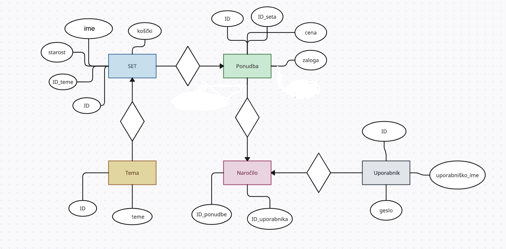

# 🧱 Lego Store – University Web Project (Python + SQL)

> Built as a university database project using **Python, SQL, BeautifulSoup**, and **Bottle** framework.

---

## 🛒 About the Project

This project simulates a functional **LEGO online store** with a fully connected backend database. Users can register, browse LEGO sets, apply advanced filters, place orders, and view their past purchases.

The application demonstrates a working prototype of an e-commerce system – built from scratch using Python and SQL – while exploring real-world database relationships and query logic.

---

## 🧰 Technologies Used

- 🐍 **Python** (Bottle framework)
- 🧠 **SQL** – 5 relational tables (ER diagram below)
- 🌐 **HTML/CSS** – basic frontend interface
- 🧼 **BeautifulSoup** – for parsing and manipulating content
- 📦 **pipenv / Pipfile** – environment & dependency management

---

## 🧩 Key Features

- 👤 **User registration and login**
- 🔍 **Advanced product filtering** (by theme, price, age, number of pieces)
- 🛒 **Shopping cart system**
- 📦 **Order tracking** – view all previous purchases
- 📊 **Database-backed filtering logic**
- 🔗 **Relational database design** (see diagram)

---

## 📚 What I Learned

> _"This was my first introduction to building real web apps with Python – it taught me how to connect logic, data, and user experience."_ 💡

- Structured a real relational database with joins and foreign keys
- Implemented filters and queries based on user selections
- Understood user flow from registration to purchase
- Learned the value of clean architecture (in hindsight 🙂)
- Gained appreciation for better frameworks and frontend tools

---

## 🧠 ER Diagram
### 🔹 ER Diagram


---

## ⚠️ Developer Note

This project was written early in my journey – the codebase is rough, but the system works. If I were to rebuild it today, I would:

- Use **Flask or Django** for the backend
- Add proper frontend styling (Bootstrap/Vue/React)
- Modularize the code for scalability
- Use ORM (like SQLAlchemy) instead of raw SQL

---

## 📦 Setup Instructions

1. Clone the repo  
2. Install dependencies:  
   ```bash
   pipenv install
