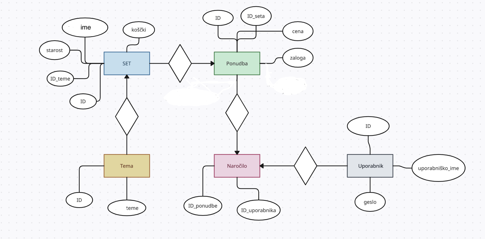

#  Lego Store – University Web Project (Python + SQL)

> Built as a university database project using **Python, SQL, BeautifulSoup**, and **Bottle** framework.

---

## 🛒 About the Project

This project simulates a functional **LEGO online store** with a fully connected backend database. Users can register, browse LEGO sets, apply advanced filters, place orders, and view their past purchases.

The application demonstrates a working prototype of an e-commerce system – built from scratch using Python and SQL – while exploring real-world database relationships and query logic.

---

##  Technologies Used

-  **Python** (Bottle framework)
-  **SQL** – 5 relational tables (ER diagram below)
-  **HTML/CSS** – basic frontend interface
-  **BeautifulSoup** – for parsing and manipulating content
-  **pipenv / Pipfile** – environment & dependency management

---

##  Key Features

-  **User registration and login**
-  **Advanced product filtering** (by theme, price, age, number of pieces)
-  **Shopping cart system**
-  **Order tracking** – view all previous purchases
-  **Database-backed filtering logic**
-  **Relational database design** (see diagram)

---

##  What I Learned

> _"This was my first introduction to building real web apps with Python – it taught me how to connect logic, data, and user experience."_ 

- Structured a real relational database with joins and foreign keys
- Implemented filters and queries based on user selections
- Understood user flow from registration to purchase
- Learned the value of clean architecture (in hindsight )
- Gained appreciation for better frameworks and frontend tools

---

##  ER Diagram
### 🔹 ER Diagram


---

##  Developer Note

This project was written early in my development journey, and the codebase reflects that.  
Still, it represents a real working web application built from scratch using Python.

If I were to rebuild it today, I would:

-  Use a more modern web framework like **Flask** or **Django** – or even **Java Spring Boot** for a scalable backend architecture.
-  Avoid scraping/BeautifulSoup for internal content and instead use proper API-based or MVC design.
-  Implement a clean, responsive UI with **React** or **Vue** and styling libraries like **Bootstrap** or **Tailwind**.
-  Structure the code into separate modules (routes, services, data access).
-  Use an ORM such as **SQLAlchemy** or **JPA/Hibernate** for safer and more maintainable database handling.
-  Optimize for performance, security, and long-term extensibility.

> _"I now understand that the best code is not just working code – it's clean, efficient, and built with future growth in mind."_


---

##  Setup Instructions

1. Clone the repo  
2. Install dependencies:  
   ```bash
   pipenv install
